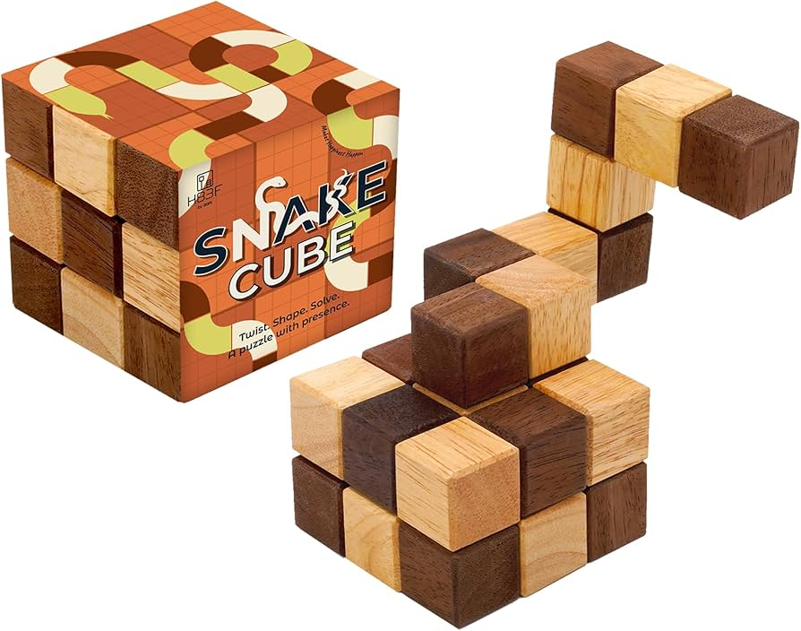
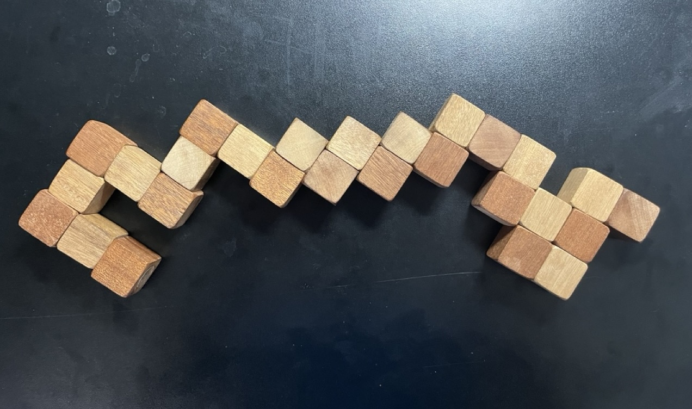
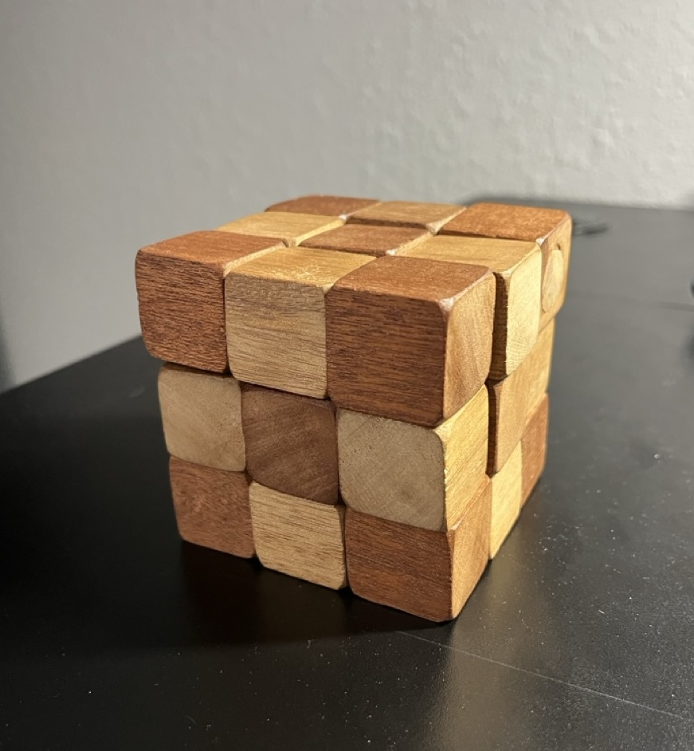

# Snake Puzzle
This is a project to solve a snake puzzle like the one below, using computational methods.

# History
The snake puzzle was gifted around 2012 and remained unsolved for over a decade. Many hours were spent over the years attempting to solve it and I came close many times, but never a complete solution. In late 2024 the idea occured to me to use computational methods to find a solution brute force and I began [sketching up a plan](assets/early_notes.pdf). But shortly after the project was put on hold until mid 2026 when I decided to just sit down and code it.

# Solution
`['Up', 'Forward', 'Down', 'Right', 'Up', 'Back', 'Down', 'Back', 'Left', 'Down', 'Right', 'Forward', 'Left', 'Up', 'Right', 'Forward', 'Up', 'Back', 'Right']`

# Proof
## Before
 

## After

# Future
I might generalize the code more to solve for larger cubes or find different solutions.